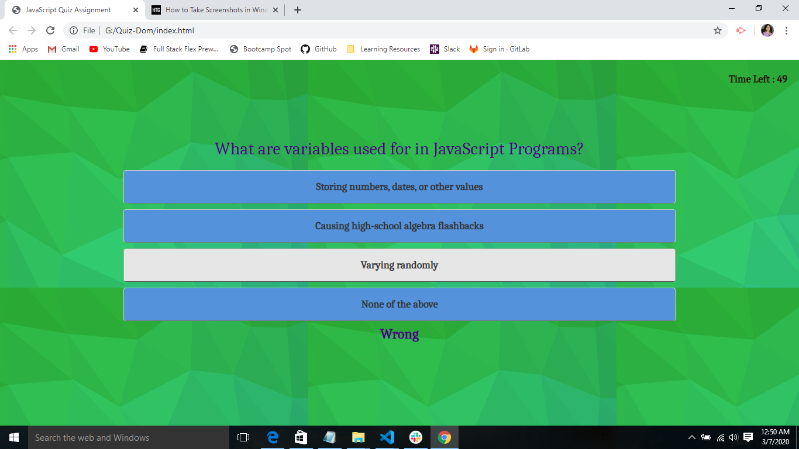
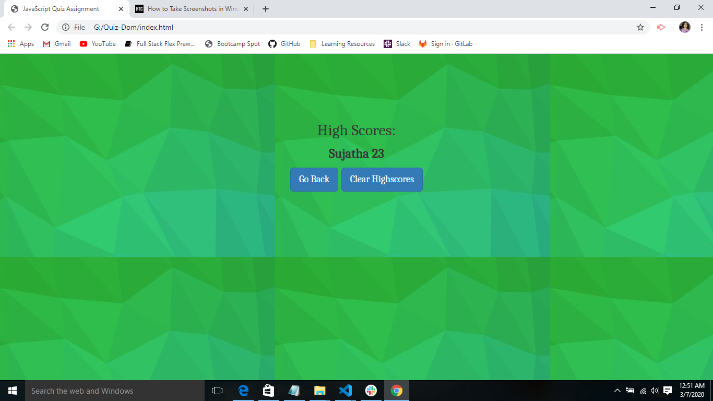

# CodeQuiz

**Deployed Web URL**
https://sujatha-m.github.io/CodeQuiz/Develop/

## Overview 
A timed code quiz application with multiple-choice questions and answers presented to the user.
Every incorrect answer decrements the timer by 10.The final score is determined by the remaining time at 
the end of the quiz.
The timer maximum duration is dynamically computed based on the number of questions available.
This application uses the formula (number_of_questions * 15secs) for timer duration.

The application has been created from scratch to define:- 
1. html elements to structure the overall layout and content of the quiz window
2. css styles accompanying the ids and classes being referenced in html and javascript
3. javascript that implements the overall functionality by making references to html 
   elements and updating the window contents accordingly. 

This app runs in the browser and features dynamically updated HTML and CSS powered by JavaScript code. 
It also features a clean,polished 
and responsive user interface, ensuring that it adapts to multiple screen sizes.

## Functionality
The user clicks "Start Quiz" button to start the quiz.This loads a new page with first question and answer choices.
The timer is also started here counting down.
When user clicks on an answer,the resulting button click validates the answer and decrements the timer by 10 for
every wrong question answered and then loads the next set of question and answers.
On reaching the end of all questions,the remaining timer value is displayed as the final score.
The user is prompted for name and the name,score pair is stored locally and retrieved to display the same on the window.
The GoBack button takes the user back to the start of the quiz.
The ClearHighScores button clears the local storage holding name,score pairs.

The following images demonstrate the application functionality:

